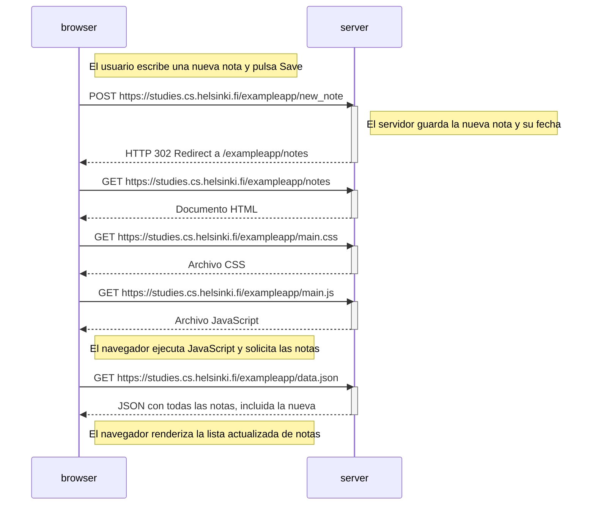

```mermaid
sequenceDiagram
    participant browser
    participant server

    Note right of browser: El usuario escribe una nueva nota y pulsa Save

    browser->>server: POST https://studies.cs.helsinki.fi/exampleapp/new_note
    activate server

    Note right of server: El servidor guarda la nueva nota y su fecha

    server-->>browser: HTTP 302 Redirect a /exampleapp/notes
    deactivate server

    browser->>server: GET https://studies.cs.helsinki.fi/exampleapp/notes
    activate server
    server-->>browser: Documento HTML
    deactivate server

    browser->>server: GET https://studies.cs.helsinki.fi/exampleapp/main.css
    activate server
    server-->>browser: Archivo CSS
    deactivate server

    browser->>server: GET https://studies.cs.helsinki.fi/exampleapp/main.js
    activate server
    server-->>browser: Archivo JavaScript
    deactivate server

    Note right of browser: El navegador ejecuta JavaScript y solicita las notas

    browser->>server: GET https://studies.cs.helsinki.fi/exampleapp/data.json
    activate server
    server-->>browser: JSON con todas las notas, incluida la nueva
    deactivate server

    Note right of browser: El navegador renderiza la lista actualizada de notas
```