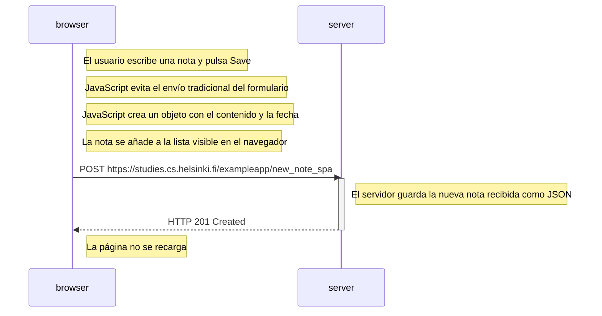

```mermaid
sequenceDiagram
    participant browser
    participant server

    Note right of browser: El usuario escribe una nota y pulsa Save

    Note right of browser: JavaScript evita el envío tradicional del formulario

    Note right of browser: JavaScript crea un objeto con el contenido y la fecha

    Note right of browser: La nota se añade a la lista visible en el navegador

    browser->>server: POST https://studies.cs.helsinki.fi/exampleapp/new_note_spa
    activate server

    Note right of server: El servidor guarda la nueva nota recibida como JSON

    server-->>browser: HTTP 201 Created
    deactivate server

    Note right of browser: La página no se recarga
```
